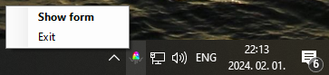
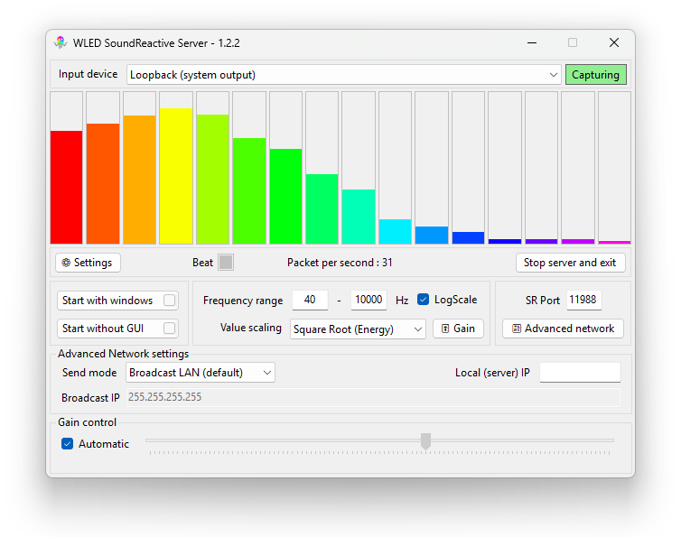

# SoundReactive WLED audio streamer for windows

## Synopsis

Feed windows audio output (in a processed form) to sound reactive wled modules without huge and complicated apps.  Not targeting vast configuration options, just the bare minimum to achieve something like this:

  

## The app itself

Probably,  most of the time you will see this little guy next to the clock telling you the server is running. From here you can open the main form or stop and exit the server.
By default, the main form will open when the app starts.

This is the main form where you can check if the capture is working, set some config values, or terminate the app.

### Input

In the top part you can select the **input device**. "Loopback" is for the general system sound. In the list you will find all the inputs your system has (like microphone, line input, webcam's mic, or other devices).
You can see the state of the capture by checking the "**Capturing**" box next to the input device selector. Its background can be gray (for a split second when the system is starting, or new input device is selected), red (if any related error occours), yellow (if the capturing is working but only silence is detected) or green (if it senses sound).

### Bars

Below that there is the FFT bars. This is a visual representation of the information sent to WLEDs. They should move to the frequencies of the music. (The way it divides the sound to this bars is configurable below) 
Also there is a **Beat** box what is should pulse to the beat. For now this is a very simple beat detection, may evolve by time. Don't count on it too much yet.

### Settings

If you are one of the lucky few who waited for this exact moment with well-prepared WLEDs, non-problematic network setup and music bangin' from your PC, then it will probably work out of the box. 
But otherwise, fear not, because the **Settings** button will open the bottom part (it is hidden by default).

### Startup

For most convenient usage you can set **Start with windows** and the app will start automatically after login. Mind you, to set this, the app may require elevated permissions (it will ask if needed).
Also, you can check **Start without GUI** and the app will only appear in the system tray at start.

### Fast Fourier

There is a setting for the **Frequency range** for the bars. By default, it is 40-10000hz to somewhat match the internal workings in WLED, but you can widen or tighten the range. Be aware that if the range is too tight, let's say 10-50hz to show only the super low frequencies, there is a possibility of having empty bars. This is not a bug nor a feature, just a side effect.
The scale can be divided linearly or on a Logarithmic scale. The latter should work as our ears. If unchecked then the frequency range will be divided into 16 equal ranges.
With **Value scaling** the bars "spikiness" can be emphasized or reduced. This settings works similar as the setting in WLED.
If you fancied, you can click on the **Gain** button to access a bit more granual settings. Here you can turn off the automatic gain control and can take over manually.

### Network

**SR Port** is the same port you have set in your WLED configuration page. By default, this is 11988.

If the bars are jumping, the *Packet per second* shows a nonzero value, WLED is properly configured but still not reacting to your audio then click on "**advanced network**" and try to set the **Local IP** to the IP your machine has in the network. If you start to type, it will autosuggest IPs it found on the network adapters and will show an error if the address is invalid, unusable, or malformed.

Also there is a bit more configuraion for the tech savy people you can check in the Network-Advanced section.

### The rest

If the app was started with the main form open, then when you close the form with the "X" you will receive a notification telling you that the app will be running in the background.

In the form there are many parts giving addition informations if you hover the mouse over them (and the form is in focus). Like the Capturing box telling more about errors, the FFT bars describing their respective frequency range, or the input fields if something is wrong with the values.

**Stop server and exit** is a mysterious button. It will end everything! :D

That's all folks, I hope it will run smoothly :)

## "Install" / update

To install, download the latest version from [releases](https://github.com/Victoare/SR-WLED-audio-server-win/releases/latest) (WledSRServer.zip) and put it somewhere on your machine. 
The app is a portable one, without any fancy installer, but it needs .NET 8.0 runtime. If you don't have the runtime already installed, then you will be prompted to do so (giving you the link to the .NET installer) at the start.

To update, just download the next version, stop the server if running, and overwrite the old one with the new.

Note: If you set the app to auto run and move the exe somewhere else, you must set it again.

## WLED Setup

WLED means ESP32 or ESP8266 modules with WLED firmware installed on them. Mode information here: https://kno.wled.ge/basics/getting-started

But to make this work, you will need a more specific version: **SoundReactive WLED**. This can be done by using ESP32 modules, with soundreactive firmware. Alternatively you can use moonmodules firmware (a frok of WLED with a bunch of added function) what also can be used with the older esp8266 module.

To set up WLED modules for basic use, you can check the link abowe also will find countless videos on youtube. It is suprisingly easy. 

If the basic settings are working, then you have to enable the AudioReactive module, the sync interface and set the Mode to "Receive, or if you have a mic connected to the ESP and wanted a fallback then "Receive or Local".
Open the Info window and check if it is turned on (the power icon should be green). If everything is working, then you should see: "*Audio Source : UDP sound sync - receiving*" and "*UDP Sound Sync : receive mode v2*" there.
If you only see "*Audio Source : UDP sound sync - idle*" it means, the wled is waiting for the audio data.

## Network - Advanced

By default (**Broadcast LAN**) the client will send broadcast packages to the whole network. This should reach your WLED modules wherever they are on your local network.

However, if you fancy (and know what are you doing), you can limit these packages by setting up **send mode**:
- **Broadcast SubNet** will send the packages only to the given part of your network. With it, you have to setup the broadcast address (list) according to your desired subnet(s).
- **Multicast** will use wled's "original concept", which is UDP multicasting. It needs IGMP snooping on the router(s) and probably won't work on consumer grade devices by default.
- **Target IP List** is for when you want to direcly target WLED instance(s). Only they will receive the packages.

Where list can be applied, the addresses can be separated by anything other than numbers or dot. (space, coma, colon, whatever)

### Connection issues

Due to the nature of UDP, especially UDP multicast (the connection type used by soundreactive wled), the app has no information if the package reaches any destination or not. Therefore, if all the settings seem to be fine there is a slight possibility that the network hardware has issues with this kind of communication. 
(I am also using consumer grade network equipment to develop and to use this app, so it should work, but there is no guarantee)

A quote from https://mm.kno.wled.ge/WLEDSR/UDP-Sound-Sync :

`UDP multicast is generally not very reliable with typical "consumer grade hardware". Some users found that creating a "port forwarding rule" on their local Wifi router helps. For example, you could create a "dynamic port forwarding rule" for UDP port 11988.`

## Libraries / assets
- https://github.com/naudio/NAudio - for capturing the audio
- https://github.com/swharden/FftSharp - for the blazing fast FFT
- https://github.com/Aircoookie/Akemi - Icon for the app

## Links
Some useful links:

**SoundReactive installers:**
- https://github.com/MoonModules/WLED/releases 
- https://wled-install.github.io/ 

**Audioreactive mod source on Aircoookie's WLED**
- https://github.com/Aircoookie/WLED/tree/main/usermods/audioreactive

**Info on WLED-sync**
- https://github.com/netmindz/WLED-sync
- https://mm.kno.wled.ge/WLEDSR/UDP-Sound-Sync
- https://github.com/zak-45/WLEDAudioSync-Chataigne-Module/blob/main/WLEDAudioSync.js - packet format (it was a huge help for the missing padding bytes)
