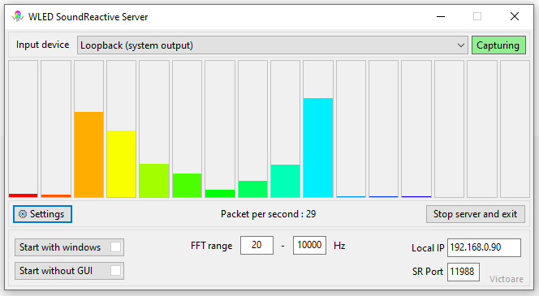

# SoundReactive WLED audio streamer for windows

## Synopsis

Feed windows audio output (in a processed form) to sound reactive wled instances without huge and complicated apps.  Not targeting vast configuration options, just the bare minimum to achieve something like this:

## The app itself

Probably,  most of the time you will see this little guy next to the clock telling you the server is running. From here you can open the main form or stop and exit the server.
By default, the main form will open when the app starts.

This is the main form where you can check if the capture is working (bars-a-jumpin' for the music you listen to and the capture box is green) and set some values.

If you are one of the lucky few who waited for this exact moment with well-prepared WLED instances, non-problematic network setup and music bangin' from your PC, then it will probably work out of the box. 
But otherwise, fear not, because the **Settings** button will open the bottom part (it is hidden by default).

For most convenient usage you can set it up to **Start with windows** and the app will start automatically after login. Mind you, to set this, the app may require elevated permissions (it will ask if needed).
Also, you can check **Start without GUI** and the app will only appear in the system tray at start.

**FFT range** will set the frequency range for the bars. By default, it is 20-20000hz, but you can widen or tighten the range. But be aware that if the range is too tight, let's say 10-50hz to show only the super low frequencies, there is a possibility of having empty bars. This is not a bug nor a feature, just a side effect.

**SR Port** is the same port you have to set up in your WLED configuration page. By default, this is 11988.

In WLED, you have to enable the AudioReactive module, the sync interface and set the Mode to Receive. Open the Info window and check if it is turned on (the power icon should be green). If everything is working, then you should see: "*Audio Source : UDP sound sync - receiving*" and "*UDP Sound Sync : receive mode v2*" there.
If you only see "*Audio Source : UDP sound sync - idle*" it means, the wled is waiting for the audio data.

If the bars are jumping, the *Packet per second* shows a nonzero value, WLED is properly configured but still not reacting to your audio then try to set the **Local IP** to the IP your machine has in the network. If you start to type, it will autosuggest IPs it found on the network adapters and will show an error if the address is invalid, unusable, or malformed.

If the app was started with the main form open, then when you close the form with the "X" you will receive a notification telling you that the app will be running in the background.

**Stop server and exit** is a mysterious button. It will end everything! :D

That's all folks, I hope it will run smoothly :)

## "Install" / update

To install, download the latest version from [releases](https://github.com/Victoare/SR-WLED-audio-server-win/releases/latest) (WledSRServer.zip) and put it somewhere on your machine. 
The app is a portable one, without any fancy installer, but it needs .NET 8.0 runtime. If you don't have the runtime already installed, then you will be prompted to do so (giving you the link to the .NET installer) at the start.

To update, just download the next version, stop the server if running, and overwrite the old one with the new.

Note: If you set the app to auto run and move the exe somewhere else, you must set it again.

## Connection issues

Due to the nature of UDP, especially UDP multicast (the connection type used by soundreactive wled), the app has no information if the package reaches any destination or not. Therefore, if all the settings seem to be fine there is a slight possibility that the network hardware has issues with this kind of communication. 
(I am also using consumer grade network equipment to develop and to use this app, so it should work, but there is no guarantee)

A quote from https://mm.kno.wled.ge/WLEDSR/UDP-Sound-Sync :

`UDP multicast is generally not very reliable with typical "consumer grade hardware". Some users found that creating a "port forwarding rule" on their local Wifi router helps. For example, you could create a "dynamic port forwarding rule" for UDP port 11988.`

## Libraries / assets
- https://github.com/naudio/NAudio - for capturing the audio
- https://github.com/swharden/FftSharp - for the blazing fast FFT
- https://github.com/Aircoookie/Akemi - Icon for the app

## Links
Some useful links:

**SoundReactive installers:**
- https://github.com/MoonModules/WLED/releases 
- https://wled-install.github.io/ 

**Info on WLED-sync**
- https://github.com/netmindz/WLED-sync
- https://mm.kno.wled.ge/WLEDSR/UDP-Sound-Sync
- https://github.com/zak-45/WLEDAudioSync-Chataigne-Module/blob/main/WLEDAudioSync.js - packet format (it was a huge help for the missing padding bytes)
